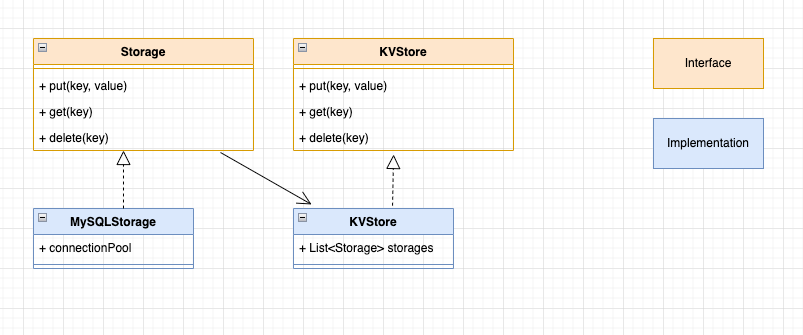

# Context
Build a toy KV store on mySQL storage

# Requirements

KV store should support below operations 

1. GET(key)
2. PUT(key, value, ttl)
3. DELETE(key)

# Class Diagram

# Approach
1. Spin up 3 mysql instance
2. Based on hashcode of key , it will route to particular shard

# Steps to run

run init.sh